# Amazon Sales Analytics Platform

Production-style analytics repository focused on commercial performance, operational reliability, and engineering clarity.

This project is intentionally scoped as a local-first data platform: no fake cloud complexity, but strong fundamentals for pipeline execution, quality control, observability, and analytical serving.

## Language Guides

- International: [README.md](README.md)
- PT-BR: [docs/README.pt-BR.md](docs/README.pt-BR.md)
- PT-PT: [docs/README.pt-PT.md](docs/README.pt-PT.md)
- Repository structure: [docs/REPOSITORY_STRUCTURE.md](docs/REPOSITORY_STRUCTURE.md)
- Contribution standards: [CONTRIBUTING.md](CONTRIBUTING.md)

## Business Scope

The platform supports recurring commercial decisions:

- revenue concentration by category and product
- discount leakage and promotional pressure
- KPI drift between runs
- data quality and contract compliance before serving outputs
- operational traceability for each execution

## Architecture at a Glance

```mermaid
flowchart LR
    A[Raw Ingestion] --> B[Contract + Schema Validation]
    B --> C[Bronze Snapshot]
    C --> D[Cleaning + Normalization]
    D --> E[Quality Gates]
    E --> F[Silver Snapshot]
    F --> G[Feature Engineering + Sales Modeling]
    G --> H[Gold Snapshot + DuckDB Materialization]
    H --> I[KPI Package + Regression]
    I --> J[Manifest + Run Status + Operational Summary]
    J --> K[Latest Snapshots for API/CLI/Streamlit]
```



Core package layout:

- `ingestion/`: raw acquisition and landing reuse
- `transformations/`: cleaning, normalization, curated outputs
- `validation/`: contracts, schema checks, quality gates
- `observability/`: logging, metrics package, KPI regression
- `serving/`: warehouse, run history, operational summary
- `pipelines/`: runtime context, manifest/status/artifact helpers

## Data and Artifact Model

Primary runtime paths (configurable):

- `data/raw/`
- `data/bronze/`
- `data/silver/`
- `data/gold/`
- `data/warehouse/`
- `data/processed/`
- `reports/tables/`
- `reports/metrics/`
- `reports/runs/`

Execution guarantees:

- deterministic `run_id` folders under `reports/runs/<run_id>/`
- immutable run-scoped artifacts (contracts, metrics, tables, status, manifest)
- stable `latest` snapshots for service consumers
- retention policy for old runs (`--retention-runs`)
- atomic writes for critical CSV/JSON outputs

## Dataset Source

- Kaggle dataset: `aliiihussain/amazon-sales-dataset`
- Retrieval package: `kagglehub`
- Raw landing: `data/raw/amazon_sales/amazon_sales_dataset.csv`

## Quickstart

```bash
python -m pip install -e .[dev]
pre-commit install
cp .env.example .env
```

Run pipeline:

```bash
# preferred in this repo context
PYTHONPATH=src python -m amazon_sales_analysis.cli.pipeline --retention-runs 60
```

Run service surfaces:

```bash
uvicorn app.api:app --reload
streamlit run app/streamlit_app.py
```

## CLI Entry Points

```bash
amazon-sales-pipeline --force-download --fail-on-kpi-regression --retention-runs 60
amazon-sales-alerts
amazon-sales-scenario
amazon-sales-warehouse --show-run-history
amazon-sales-warehouse --compare-latest-runs
amazon-sales-warehouse --show-operational-summary
```

If shell entry points are unavailable in your environment, use:

```bash
PYTHONPATH=src python -m amazon_sales_analysis.cli.pipeline
PYTHONPATH=src python -m amazon_sales_analysis.cli.warehouse --show-operational-summary
```

## API Surface

- `GET /health`
- `GET /health/ready`
- `GET /metrics/summary`
- `GET /metrics/opportunities`
- `GET /metrics/monthly-trend`
- `GET /insights/executive`
- `GET /recommendations/actionable`
- `GET /quality/gates`
- `GET /kpis/catalog`
- `GET /alerts/discount-spikes`
- `GET /warehouse/category-revenue`
- `GET /pipeline/runs`
- `GET /pipeline/runs/compare-latest`
- `GET /operations/latest`

## Reliability and Operations

### Run Lifecycle

1. Ensure source availability (reuse or download).
2. Validate raw contract and schema.
3. Build bronze/silver/gold layers.
4. Enforce quality gates on curated data.
5. Compute KPI package and regression checks.
6. Persist manifest, run status, and operational summary.
7. Publish latest snapshots for consumption.
8. Apply run retention policy.

### Common Operational Cases

- **Freshness gate fails**:
  Increase `AMAZON_SALES_MAX_DATA_STALENESS_DAYS` for historical datasets in local/demo contexts.
- **No drift panel in dashboard**:
  Requires at least two successful runs.
- **No console script command found**:
  Use module execution with `PYTHONPATH=src`.

## Configuration

Environment values are documented in `.env.example`.

Key operational variables:

- `AMAZON_SALES_ENV`
- `AMAZON_SALES_LOG_LEVEL`
- `AMAZON_SALES_ENABLE_DOWNLOAD`
- `AMAZON_SALES_MAX_DATA_STALENESS_DAYS`
- `AMAZON_SALES_KPI_REGRESSION_TOLERANCE_PCT`
- `AMAZON_SALES_WAREHOUSE_MATERIALIZATION_MODE`
- `AMAZON_SALES_DATA_DIR`
- `AMAZON_SALES_REPORTS_DIR`
- `AMAZON_SALES_CONTRACTS_DIR`
- `AMAZON_SALES_KAGGLE_DATASET`

## Quality Gates

Required local validation before PR:

```bash
make quality
make test
make build-check
```

Equivalent commands:

- `black --check .`
- `isort --check-only .`
- `ruff check .`
- `mypy src tests app alerts scripts`
- `pytest -q`
- `python -m build --sdist --wheel`

CI runs the same gates on Python 3.12 and 3.13.

## Governance and LGPD

- repository examples/tests use synthetic fixtures
- credentials are externalized via environment files
- only operational/aggregated analytics artifacts are persisted by default
- run manifest and status provide traceability for audits
- retention is explicit and configurable by run count

## Engineering Decisions

- Local-first orchestration, explicit and inspectable.
- DuckDB optional; fallback behavior remains functional.
- Thin API/CLI/dashboard layers reusing core package logic.
- Compatibility shims preserved for import stability during package evolution.

## Trade-offs

- no external scheduler/orchestrator
- no centralized telemetry backend
- no cloud object storage metadata layer
- no full incremental warehouse strategy yet

## Documentation

- [CONTRIBUTING.md](CONTRIBUTING.md)
- [docs/REPOSITORY_STRUCTURE.md](docs/REPOSITORY_STRUCTURE.md)
- [docs/README.en.md](docs/README.en.md)
- [docs/README.pt-BR.md](docs/README.pt-BR.md)
- [docs/README.pt-PT.md](docs/README.pt-PT.md)

## License

Apache License 2.0. See [LICENSE](LICENSE).
