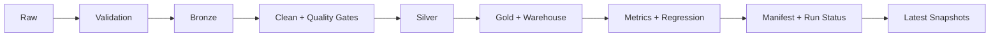

# Amazon Sales Analytics Platform (International Guide)

## Language Switch

- International: [../README.md](../README.md)
- PT-BR: [README.pt-BR.md](README.pt-BR.md)
- PT-PT: [README.pt-PT.md](README.pt-PT.md)
- Contributing: [../CONTRIBUTING.md](../CONTRIBUTING.md)
- Repository structure: [REPOSITORY_STRUCTURE.md](REPOSITORY_STRUCTURE.md)

## Purpose

This document is the international quick guide for the repository. The canonical architectural and contribution standards live in the main [README](../README.md) and in [CONTRIBUTING.md](../CONTRIBUTING.md).

The platform is designed to demonstrate a small but credible data system with:

- reproducible batch execution
- layered raw-to-curated data processing
- contract and quality enforcement
- KPI regression controls across runs
- analytical serving through API, CLI, and Streamlit
- operational visibility through manifests, run status, and summaries

## Dataset Source

- Kaggle dataset: `aliiihussain/amazon-sales-dataset`
- Retrieval package: `kagglehub`
- Raw landing path: `data/raw/amazon_sales/amazon_sales_dataset.csv`

## Business Questions

The project is structured to answer commercial questions such as:

- how much revenue was generated and how much was lost to discount leakage
- which categories concentrate revenue and promotional pressure
- where discount spikes require follow-up
- whether commercial KPIs are stable or drifting
- whether the latest execution produced reliable analytical outputs

## Architecture Snapshot

```text
data/
|-- raw/
|-- bronze/
|-- silver/
|-- gold/
`-- warehouse/

reports/
|-- figures/
|-- metrics/
|-- runs/
`-- tables/
```

Domain packages:

- `ingestion/`
  raw dataset acquisition and landing reuse
- `transformations/`
  cleaning, normalization, deduplication, and processed outputs
- `validation/`
  contracts, schema enforcement, and quality gates
- `observability/`
  logging, metrics packaging, and KPI regression controls
- `serving/`
  warehouse materialization, run history, and operational summaries
- `pipelines/`
  shared runtime helpers for manifests, status, and artifact persistence

## Mermaid Snapshot



## Execution Surfaces

CLI:

```bash
amazon-sales-pipeline
amazon-sales-pipeline --force-download
amazon-sales-pipeline --fail-on-kpi-regression
amazon-sales-pipeline --retention-runs 60
amazon-sales-alerts
amazon-sales-scenario
amazon-sales-warehouse --show-operational-summary
```

API:

- `GET /health`
- `GET /health/ready`
- `GET /metrics/summary`
- `GET /warehouse/category-revenue`
- `GET /pipeline/runs`
- `GET /pipeline/runs/compare-latest`
- `GET /operations/latest`

Dashboard:

- Streamlit exposes both analytical KPIs and operational run visibility.

## Runtime and Reliability

Implemented guarantees:

- deterministic artifact layout by `run_id`
- run-scoped artifacts persisted under `reports/runs/<run_id>/`
- stable `latest` analytical snapshots published for API/CLI consumers
- configurable retention of run artifacts (`--retention-runs`)
- local raw-file reuse for controlled reprocessing
- atomic writes for critical CSV and JSON artifacts
- curated dataset quality gates
- KPI regression comparison against a stored baseline
- local warehouse materialization when DuckDB is available

## Artifact Lifecycle

- each execution writes immutable artifacts under `reports/runs/<run_id>/`
- stable `latest` snapshots are published in `reports/metrics/` and `reports/tables/`
- retention is configurable with `amazon-sales-pipeline --retention-runs <N>`
- run manifests keep hashes and layer output paths for audit and replay

## Quickstart and Operations

```bash
python -m pip install -e .[dev]
amazon-sales-pipeline --retention-runs 60
amazon-sales-warehouse --show-operational-summary
```

## Governance and LGPD-like Practices

- only operational and aggregated analytical outputs are persisted by default
- environment-driven configuration keeps credentials out of versioned source files
- contracts, manifests, and run status artifacts improve auditability and accountability
- synthetic fixtures are used in tests to avoid exposing sensitive production data

## Engineering Decisions

- The repository stays local-first instead of simulating cloud infrastructure without operational value.
- API, CLI, and dashboard layers are thin and rely on shared package logic.
- Compatibility shims remain available to preserve stable import paths during package evolution.
- Operational artifacts are stored locally to keep the project reproducible and easy to inspect.

## Validation Workflow

```bash
make quality
make test
make build-check
```

Validation currently includes:

- `black --check .`
- `isort --check-only .`
- `ruff check .`
- `mypy src tests app alerts scripts`
- `pytest -q`
- `python -m build --sdist --wheel`

The same quality gates run in GitHub Actions CI for Python 3.12 and 3.13.

## Trade-offs

- no external scheduler or orchestrator
- no centralized telemetry backend
- no remote metadata store
- no fully incremental warehouse strategy yet

## Next References

- Main overview: [../README.md](../README.md)
- Contribution guide: [../CONTRIBUTING.md](../CONTRIBUTING.md)
- Structure guide: [REPOSITORY_STRUCTURE.md](REPOSITORY_STRUCTURE.md)
