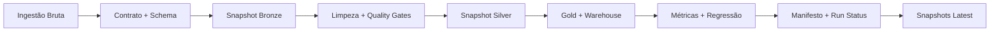

# Amazon Sales Analytics Platform (Guia PT-BR)

Este documento resume arquitetura, operação e padrão de engenharia para avaliação técnica rápida.

Referências canônicas:

- Visão principal: [../README.md](../README.md)
- Fluxo de contribuição: [../CONTRIBUTING.md](../CONTRIBUTING.md)
- Estrutura do repositório: [REPOSITORY_STRUCTURE.md](REPOSITORY_STRUCTURE.md)

## Escopo

O projeto demonstra um fluxo analítico orientado a produção com:

- execução batch reprocessável
- validação de contrato, schema e qualidade
- controle de regressão de KPIs entre runs
- evidência operacional por execução
- superfícies de consumo via API, CLI e dashboard

## Fluxo de Runtime



## Comandos Principais

```bash
PYTHONPATH=src python -m amazon_sales_analysis.cli.pipeline --retention-runs 60
PYTHONPATH=src python -m amazon_sales_analysis.cli.warehouse --show-operational-summary
uvicorn app.api:app --reload
streamlit run app/streamlit_app.py
```

## Confiabilidade Operacional

- artefatos imutáveis em `reports/runs/<run_id>/`
- snapshots `latest` estáveis para consumo
- retenção explícita de runs
- status operacional preservado também em falhas
- metadados de execução auditáveis

## Qualidade

```bash
make quality
make test
make build-check
```

Inclui:

- `black --check .`
- `isort --check-only .`
- `ruff check .`
- `mypy src tests app alerts scripts`
- `pytest -q`
- `python -m build --sdist --wheel`

## Governança

- testes com dados sintéticos por padrão
- configuração orientada por ambiente
- rastreabilidade por run status e manifesto
- arquitetura local-first com trade-offs explícitos

## Idiomas

- International: [../README.md](../README.md)
- PT-BR: [README.pt-BR.md](README.pt-BR.md)
- PT-PT: [README.pt-PT.md](README.pt-PT.md)

