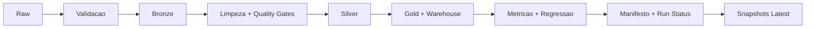

# Amazon Sales Analytics Platform (Guia PT-PT)

## Seleção de Idioma

- International: [../README.md](../README.md)
- PT-BR: [README.pt-BR.md](README.pt-BR.md)
- PT-PT: [README.pt-PT.md](README.pt-PT.md)
- Contribuição: [../CONTRIBUTING.md](../CONTRIBUTING.md)
- Estrutura do repositório: [REPOSITORY_STRUCTURE.md](REPOSITORY_STRUCTURE.md)

## Propósito

Este documento é o guia rápido em PT-PT do repositório. O padrão canónico de arquitetura e contribuição está no [README principal](../README.md) e em [CONTRIBUTING.md](../CONTRIBUTING.md).

A plataforma foi estruturada para demonstrar um sistema de dados pequeno, mas credível, com:

- execução batch reproduzível
- processamento em camadas do dado bruto ao curado
- validação de contratos e controlos de qualidade
- controlo de regressão de KPIs entre execuções
- disponibilização analítica via API, CLI e Streamlit
- visibilidade operacional por manifestos, estado de execução e sumários

## Fonte do Dataset

- Dataset Kaggle: `aliiihussain/amazon-sales-dataset`
- Pacote de ingestão: `kagglehub`
- Caminho bruto local: `data/raw/amazon_sales/amazon_sales_dataset.csv`

## Perguntas de Negócio

O projeto foi desenhado para responder a perguntas comerciais como:

- quanta receita foi gerada e quanto se perdeu por fuga de desconto
- que categorias concentram receita e pressão promocional
- onde existem picos de desconto que exigem acompanhamento
- se os KPIs comerciais estão estáveis ou em drift
- se a última execução gerou saídas analíticas fiáveis

## Visão da Arquitetura

```text
data/
|-- raw/
|-- bronze/
|-- silver/
|-- gold/
`-- warehouse/

reports/
|-- figures/
|-- metrics/
|-- runs/
`-- tables/
```

Pacotes de domínio:

- `ingestion/`
  aquisição do dataset bruto e reutilização da landing local
- `transformations/`
  limpeza, normalização, deduplicação e persistência de saídas processadas
- `validation/`
  contratos, validação de esquema e controlos de qualidade
- `observability/`
  logging, empacotamento de métricas e controlo de regressão de KPIs
- `serving/`
  materialização do warehouse, histórico de execuções e sumários operacionais
- `pipelines/`
  utilitários partilhados de execução para manifestos, estado e persistência

## Snapshot Mermaid



## Superfícies de Execução

CLI:

```bash
amazon-sales-pipeline
amazon-sales-pipeline --force-download
amazon-sales-pipeline --fail-on-kpi-regression
amazon-sales-pipeline --retention-runs 60
amazon-sales-alerts
amazon-sales-scenario
amazon-sales-warehouse --show-operational-summary
```

API:

- `GET /health`
- `GET /health/ready`
- `GET /metrics/summary`
- `GET /warehouse/category-revenue`
- `GET /pipeline/runs`
- `GET /pipeline/runs/compare-latest`
- `GET /operations/latest`

Dashboard:

- O Streamlit expõe KPIs analíticos e visibilidade operacional das execuções.

## Runtime e Confiabilidade

Garantias já implementadas:

- layout determinístico de artefactos por `run_id`
- artefactos por execução persistidos em `reports/runs/<run_id>/`
- snapshots analíticos `latest` estáveis para consumidores de API/CLI
- retenção configurável de execuções (`--retention-runs`)
- reutilização controlada do ficheiro bruto para reprocessamento
- escrita atómica de CSVs e JSONs críticos
- controlos de qualidade sobre o dataset curado
- comparação de regressão de KPIs contra uma linha de base persistida
- materialização local do warehouse quando DuckDB está disponível

## Governança e Boas Práticas LGPD

- por omissão, o pipeline persiste saídas operacionais e analíticas agregadas
- configuração por ambiente evita credenciais em ficheiros versionados
- contratos, manifestos e estado de execução reforçam auditoria e rastreabilidade
- os testes usam dados sintéticos para evitar exposição de dados sensíveis de produção

## Ciclo de Vida dos Artefactos

- cada execução gera artefactos imutáveis em `reports/runs/<run_id>/`
- snapshots `latest` são publicados em `reports/metrics/` e `reports/tables/`
- a retenção é configurável com `amazon-sales-pipeline --retention-runs <N>`
- manifestos registam hashes e caminhos para replay e análise de incidentes

## Quickstart e Operação

```bash
python -m pip install -e .[dev]
amazon-sales-pipeline --retention-runs 60
amazon-sales-warehouse --show-operational-summary
```

## Decisões de Engenharia

- O repositório mantém-se local-first em vez de simular infraestrutura cloud sem valor operacional real.
- API, CLI e dashboard são finos e reutilizam a mesma lógica do pacote.
- Os módulos de compatibilidade continuam disponíveis para preservar imports estáveis durante a evolução da estrutura.
- Os artefactos operacionais ficam locais para manter o projeto reproduzível e fácil de auditar.

## Fluxo de Validação

```bash
make quality
make test
make build-check
```

A validação atual inclui:

- `black --check .`
- `isort --check-only .`
- `ruff check .`
- `mypy src tests app alerts scripts`
- `pytest -q`
- `python -m build --sdist --wheel`

Os mesmos gates de qualidade correm no GitHub Actions CI para Python 3.12 e 3.13.

## Trade-offs

- não existe scheduler ou orquestrador externo
- não existe backend centralizado de telemetria
- não existe repositório remoto de metadados
- ainda não existe uma estratégia completa de materialização incremental no warehouse

## Próximas Referências

- Visão principal: [../README.md](../README.md)
- Guia de contribuição: [../CONTRIBUTING.md](../CONTRIBUTING.md)
- Guia de estrutura: [REPOSITORY_STRUCTURE.md](REPOSITORY_STRUCTURE.md)
