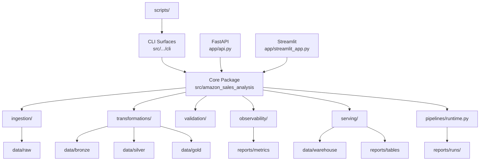

# Repository Structure

This document describes the intended repository topology and the placement rules behind it. The goal is not only cleanliness; it is to keep operational concerns, analytical logic, and execution surfaces easy to understand and evolve.

## Architecture Intent

The repository is organized around five concerns:

- runtime and configuration
- domain logic
- execution surfaces
- generated artifacts
- contribution and automation metadata

That separation keeps the codebase readable while still looking like a small real data platform instead of a loose collection of scripts.

## Top-Level Blueprint

```text
.
|-- .github/
|-- alerts/
|-- app/
|-- assets/
|-- contracts/
|-- data/
|-- docs/
|-- notebooks/
|-- reports/
|-- scripts/
|-- sql/
|-- src/
|-- tests/
|-- .env.example
|-- CHANGELOG.md
|-- CONTRIBUTING.md
|-- Dockerfile
|-- Makefile
|-- README.md
|-- main.py
`-- pyproject.toml
```

## Architecture Map (Mermaid)



Local environment folders such as `.venv/`, `.pytest_cache/`, `build/`, and `dist/` are intentionally excluded from this blueprint because they are not part of the source architecture.

## Top-Level Directories

### `.github/`

Repository governance and automation:

- GitHub Actions workflows
- issue templates
- PR template
- `CODEOWNERS`

### `alerts/`

Thin alert-specific wrappers kept outside the core package for operational convenience.

### `app/`

Application entry points:

- `api.py`
  FastAPI service for health, metrics, alerts, warehouse access, and run history.
- `streamlit_app.py`
  Streamlit dashboard for analytical and operational visibility.

### `assets/`

Static assets used by presentation layers, such as CSS and brand visuals.

### `contracts/`

Versioned or generated contract artifacts that describe important dataset expectations.

### `data/`

Local runtime storage for pipeline inputs and outputs:

- `raw/`
- `bronze/`
- `silver/`
- `gold/`
- `warehouse/`
- `processed/`

These directories are operational artifacts, not business logic.

### `docs/`

Repository-level documentation, multilingual overviews, and structure guidance.

### `notebooks/`

Exploratory analysis only. Notebook content must not be the source of truth for reusable production logic.

### `reports/`

Generated outputs and operational artifacts:

- figures
- tables
- metrics
- run manifests
- run status
- operational summaries

Operational conventions:

- immutable run artifacts under `reports/runs/<run_id>/`
- stable snapshots in `reports/metrics/` and `reports/tables/` for API/CLI consumers
- retention of old run directories controlled via `amazon-sales-pipeline --retention-runs`

### `scripts/`

Thin wrappers around package entry points. Scripts should orchestrate; they should not own domain logic.

### `sql/`

Versioned SQL assets used by the warehouse layer.

### `src/`

The source of truth for reusable application and platform logic.

### `tests/`

Automated validation for behavior, contracts, and operational guarantees.

## Python Package Layout

The main package lives under [`src/amazon_sales_analysis`](/C:/Users/samue/PycharmProjects/amazon-sales-analysis/src/amazon_sales_analysis).

### Runtime and shared infrastructure

- `config.py`
  Environment-aware settings and directory resolution.
- `pipelines/runtime.py`
  Run context, manifests, status tracking, and atomic artifact persistence.
- `operations.py`
  Compatibility export for operational summary helpers.

### Domain packages

- `ingestion/`
  Raw acquisition and landing.
- `transformations/`
  Cleaning, normalization, deduplication, and processed outputs.
- `validation/`
  Contracts, schema enforcement, and quality gates.
- `observability/`
  Logging, metric packaging, and KPI regression controls.
- `serving/`
  Warehouse materialization, warehouse access, run history, and operational summaries.

### Analytical modules

These modules represent business-facing logic that consumes curated data and produces insights, simulations, tables, or models:

- `analytics.py`
- `anomaly_detection.py`
- `business_metrics.py`
- `decision_engine.py`
- `eda.py`
- `evaluation.py`
- `feature_engineering.py`
- `insights.py`
- `modeling.py`
- `sales_analysis.py`
- `scenario_simulator.py`
- `table_organization.py`
- `visualization.py`

### CLI surfaces

- `cli/pipeline.py`
- `cli/alerts.py`
- `cli/scenario.py`
- `cli/warehouse.py`

CLI modules should remain thin and delegate work to reusable package logic.

### Compatibility shims

The package root still exposes modules such as:

- `contracts.py`
- `data_ingestion.py`
- `data_preprocessing.py`
- `logging_config.py`
- `metrics.py`
- `quality.py`
- `run_history.py`
- `warehouse.py`
- `warehouse_service.py`

These exist to preserve stable import paths while the repository evolves toward the domain-oriented layout.

Rules for shims:

- prefer domain packages in new code
- keep exports explicit
- protect public shim behavior with tests
- document deprecation before removal

## Placement Rules

- Put reusable logic in `src/`, not in `scripts/` or `notebooks/`.
- Put warehouse SQL in `sql/`, not inline in the app layer when it needs to be versioned.
- Put generated artifacts in `data/` or `reports/`, not under source folders.
- Keep API, Streamlit, and CLI surfaces thin.
- Keep architecture and contribution standards updated when the layout changes.
- Ensure run-level artifacts remain immutable; publish mutable `latest` snapshots as a separate concern.

## Dataset Source

- Kaggle dataset: `aliiihussain/amazon-sales-dataset`
- Retrieval package: `kagglehub`
- Local raw landing path: `data/raw/amazon_sales/amazon_sales_dataset.csv`

## What This Structure Optimizes For

- easier onboarding for technical reviewers
- lower coupling between execution surfaces and core logic
- clearer ownership of validation and observability concerns
- safer package evolution without breaking existing imports
- a repository shape that looks intentional under hiring review
