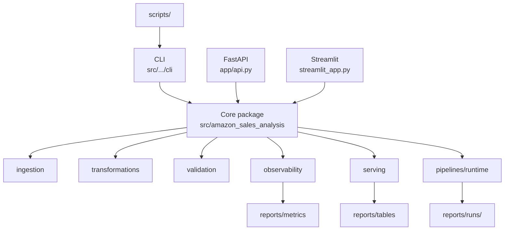

# Repository Structure

This document defines topology, ownership boundaries, and placement rules for the repository.

Goal: keep operational code paths explicit, make failures diagnosable, and keep change impact understandable during code review.

## Topology

```text
.
|-- .github/
|-- alerts/
|-- app/
|-- assets/
|-- contracts/
|-- data/
|-- docs/
|-- notebooks/
|-- reports/
|-- scripts/
|-- sql/
|-- src/
|-- tests/
|-- .env.example
|-- CHANGELOG.md
|-- CONTRIBUTING.md
|-- Dockerfile
|-- LICENSE
|-- Makefile
|-- README.md
`-- pyproject.toml
```

## Architecture Map



## Ownership by Directory

### `.github/`

Governance and automation:

- CI workflows
- issue forms
- PR template
- code ownership and process metadata

### `app/`

Delivery surfaces only:

- API entry point

Rule: no core business logic here.

### `src/amazon_sales_analysis/`

Source of truth for reusable logic.

Domain boundaries:

- `ingestion/`
- `transformations/`
- `validation/`
- `observability/`
- `serving/`
- `pipelines/`

### `sql/`

Versioned SQL used by warehouse materialization/query semantics.

### `tests/`

Behavioral and contract validation for runtime, domain logic, and compatibility surfaces.

### `data/` and `reports/`

Generated runtime artifacts, not source code.

`reports/runs/<run_id>/` is immutable run-level evidence:

- status
- manifest
- contracts
- metrics
- tables

Mutable `latest` snapshots are published separately for API/CLI/dashboard consumption.

### `docs/`

Repository standards and multilingual overviews.

### `notebooks/`

Exploration only. Reusable logic must be moved to `src/`.

## Placement Rules

- Put reusable Python logic in `src/`.
- Keep API/CLI/dashboard thin and delegating.
- Put versioned SQL in `sql/`.
- Keep generated artifacts out of source directories.
- Keep run-scoped artifacts immutable.
- Publish mutable `latest` snapshots as a separate step.

## Compatibility Surface

Root package compatibility modules (for stable imports) are intentionally preserved:

- `contracts.py`
- `data_ingestion.py`
- `data_preprocessing.py`
- `logging_config.py`
- `metrics.py`
- `quality.py`
- `run_history.py`
- `warehouse.py`
- `warehouse_service.py`

Rules:

- new code should import from domain packages
- re-export behavior must remain explicit and tested
- deprecations must be documented before removal

## What This Structure Optimizes

- reviewable change scope
- lower coupling between delivery and domain logic
- reproducible operational runs with clear lineage
- maintainable package evolution without breaking callers
